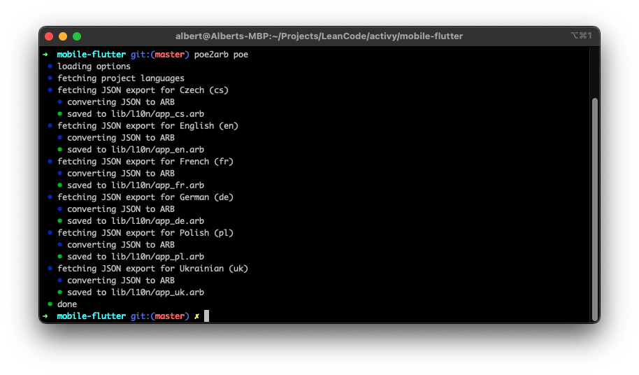

<div align="center">

# poe2arb

[![Latest GitHub release][github-release-img]][github-release-link]
[![CI status(main branch)][ci-status-img]][ci-status-link]


</div>

`poe2arb` is a CLI tool that lets the POEditor work with Flutter's native
localization solution (`flutter gen-l10n`).

## Installation

You can download latest or historical binary straight from the [GitHub
releases][releases] artifacts or using Homebrew:

```
brew tap leancodepl/poe2arb
brew install poe2arb
```

## Usage

`poe2arb` operates on POEditor's _JSON_ (not _JSON key-value_) export file
format.

**TL;DR:** Use `poe2arb poe` command for a seamless integration.

### Conversion

`poe2arb convert` command only converts the POE export to ARB format. Refer to
[Supported features](#syntax--supported-features) section.

For conversion, you need to pass the translation file language in the
`--lang/-l` flag

Currently, only an stdin/stdout is supported for the `poe2arb convert` command.

#### stdin/stdout

```
poe2arb convert io --lang en < Hello_World_English.json > lib/l10n/app_en.arb
```

### Full POEditor integration

`poe2arb poe` command is your Swiss Army Knife enabling integrating POEditor
into your Flutter workspace in one command:

1. Fetches all project languages from API.
2. Downloads JSON exports for all languages from API.
3. Converts JSON exports to ARB format.
4. Saves converted ARB files to the output directory.

#### Options

| Flag               | Description                                                                                                       | Default                                                                                                             |
|--------------------|-------------------------------------------------------------------------------------------------------------------|---------------------------------------------------------------------------------------------------------------------|
| `-p, --project-id` | **Required.** POEditor project ID. It is visible in the URL of the project on POEditor website.                   | Defaults to `poeditor-project-id` from `l10n.yaml` file. If it's empty, then defaults to `POEDITOR_PROJECT_ID` env. |
| `-t, --token`      | **Required.** POEditor API read-only access token. Available in [Account settings > API access][poeditor-tokens]. | Defaults to `POEDITOR_TOKEN` env.                                                                                   |
| `-o, --output-dir` | ARB files output directory.                                                                                       | Defaults to `arb-dir` from `l10n.yaml`. If it's empty, then defaults to `.`.                                        |
| `--langs`          | Exported languages override.                                                                                      | Defaults to empty, no override.                                                                                     |
| `--el-compat`      | [`easy_localization`][easy_localization] compatibility mode. More in [this section][el-compat-mode].              | Defaults to `false`.                                                                                                |

## Syntax & supported features

Term name must be a valid Dart field name, additionaly, it must start with a
lowercase letter ([Flutter's constraint][term-name-constraint]).

### Placeholders

Placeholders are created by putting a text between brackets inside a term.
Placeholder name must be a valid Dart parameter name.

Example:

```
Hello, {name}!
```

Placeholders have an `Object` type and are displayed using `toString()`. An
exception for that is the `count` placeholder when the term is plural, which has
an `int` type.

#### `easy_localization` compatibility mode

> **Note:** It is advised to not use the compatibility mode and to migrate from
> it, if possible.

`--el-compat` flag enables compatibility with
[`easy_localization`][easy_localization]'s positional arguments. A positional
argument is just a pair of open&close brackets `{}`. Each positional argument
will be parsed as `pos1`, `pos2`, `posN` placeholders.

Plurals can't be used with positional arguments. If you want to use plural term,
replace positional arguments with named (normal) ones.

Example:

```
Field {} must not be empty.
```

### Plurals

POEditor plurals are also supported. Simply mark the the term and plural and
give it _any_ name (it's never used, but required by POEditor to enable plurals
for the term).

In translations, a `{count}` placeholder (`int` formatted as `decimalPattern`)
can be used. You can use other placeholders too. Example:

```
one:    Andy has 1 kilogram of {fruit}.
other:  Andy has {count} kilograms of {fruit}.
```

## Contributing

### Formatting

We use [gofumpt][gofumpt], which is a superset of [gofmt][gofmt].

To make `gopls` in VS Code use `gofumpt`, add this to your settings:

```json
"gopls": {
    "formatting.gofumpt": true
},
```

### Linting

We use [staticcheck][staticcheck] with all checks enabled.

To make VS Code use `staticcheck`, add this to your settings:

```json
"go.lintTool": "staticcheck",
"go.lintFlags": ["-checks=all"],
```

### Building

All you need is Go 1.19.

```
go build .
```

### Releasing

Create a _lightweight_ git tag and push it. GitHub Actions with a GoReleaser
workflow will take care of the rest.

```
git tag v0.1.1
git push --tags
```

[github-release-link]: https://github.com/leancodepl/poe2arb/releases
[github-release-img]: https://img.shields.io/github/v/release/leancodepl/poe2arb?label=version&sort=semver
[ci-status-link]: https://github.com/leancodepl/poe2arb/actions/workflows/go-test.yml
[ci-status-img]: https://img.shields.io/github/workflow/status/leancodepl/poe2arb/Test/main
[releases]: https://github.com/leancodepl/poe2arb/releases
[poeditor-tokens]: https://poeditor.com/account/api
[easy_localization]: https://pub.dev/packages/easy_localization
[el-compat-mode]: #easy_localization-compatibility-mode
[term-name-constraint]: https://github.com/flutter/flutter/blob/ce318b7b539e228b806f81b3fa7b33793c2a2685/packages/flutter_tools/lib/src/localizations/gen_l10n.dart#L868-L886
[gofumpt]: https://github.com/mvdan/gofumpt
[gofmt]: https://pkg.go.dev/cmd/gofmt
[staticcheck]: https://staticcheck.io
